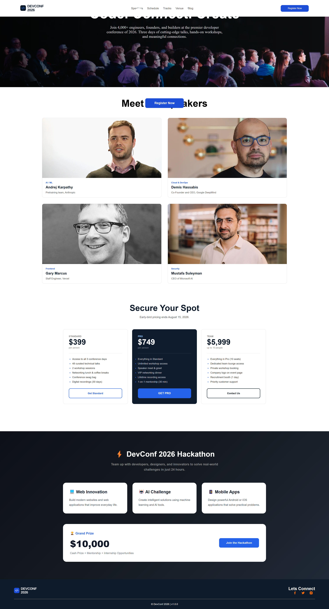

# 🚀 DevConf 2026

DevConf 2026 is a responsive developer conference website designed for a fictional developer conference. The website provides information about the conference, speakers, ticket plans, and a 24-hour hackathon.

I built this project using HTML and CSS to practice creating a complete multi-section landing page, working with layouts, cards, buttons, background images, responsive design, and hover effects.

## 📸 Project Screenshot

## 🛠️ Technologies Used

The main technologies I used to build this project are:

| Technology | Purpose |
|---|---|
| HTML5 | Creating the structure and content of the website |
| CSS3 | Styling, layouts, colors, spacing, and responsive design |
| CSS Grid | Creating speaker, pricing, and hackathon card layouts |
| CSS Flexbox | Creating navigation, footer, and other flexible layouts |
| CSS Media Queries | Making the website responsive on different screen sizes |
| CSS Hover Effects | Adding interactive effects to buttons and cards |

## ✨ Main Features

### 1. Navigation Bar

The website has a clean navigation bar with links to:

- Speakers
- Schedule
- Tracks
- Venue
- Blog
- Register Now button

The navigation layout is created using CSS Flexbox.

### 2. Hero Section

The hero section introduces the DevConf 2026 conference with:

- Main conference title
- Short conference description
- Background banner image
- Register Now button
- Dark overlay for better text visibility

The hero section is designed to make the main purpose of the website clear immediately.

### 3. Meet the Speakers

The speaker section displays information about four conference speakers.

Each speaker card contains:

- Speaker image
- Speaker category
- Speaker name
- Job/company information

The cards are arranged using CSS Grid.

### 4. Secure Your Spot

The pricing section contains three different ticket plans:

- Standard
- Pro
- Team

Each plan includes:

- Ticket price
- Number of attendees
- Included benefits
- Registration/contact button

The Pro plan has a different dark design to make it visually different from the other plans.

### 5. DevConf 2026 Hackathon

The website also includes a dedicated hackathon section.

It contains three challenge categories:

- 💻 Web Innovation
- 🤖 AI Challenge
- 📱 Mobile Apps

There is also a Grand Prize section showing the `$10,000` prize along with mentorship and internship opportunities.

A hover effect has been added to the hackathon cards to make the section more interactive.

### 6. Footer

The footer contains:

- DevConf logo
- Social media links
- Facebook
- Twitter/X
- Instagram
- Copyright information

### 7. Responsive Design

I added CSS media queries to make the website work better on smaller screen sizes.

The hackathon cards change from three columns to a single-column layout on smaller screens, and the hackathon footer also changes to a vertical layout.

## 📦 Dependencies

This project does not use any external npm packages or JavaScript libraries.

It is built using:

- HTML5
- CSS3

No `npm install` or package manager is required to run this project.

The project also uses local image assets from the `assets` folder.

